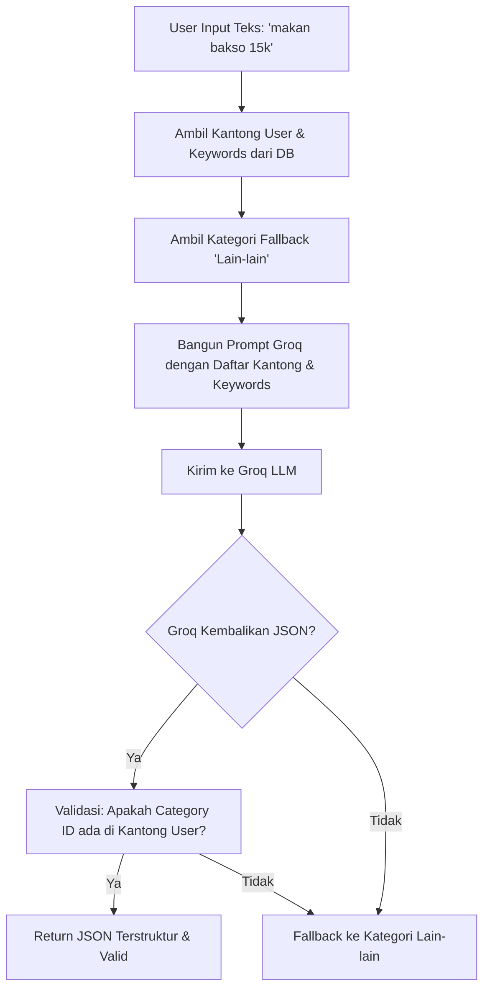

# 🤖 Kainest Backend - Software Requirements Specification (SRS) & Guidelines

Dokumen ini mendefinisikan spesifikasi kebutuhan perangkat lunak (SRS), arsitektur, spesifikasi database, spesifikasi API, daftar perbaikan sistem terbaru, serta rencana pengembangan masa depan untuk **Kainest Backend (Kainest_Be)**. Dokumen ini ditujukan bagi pengembang dan AI Agent yang bekerja pada repositori ini.

---

## 1. PENDAHULUAN (SYSTEM OVERVIEW)
Kainest Backend adalah layanan API server berbasis **Hono (Node.js)** yang menyediakan backend engine untuk aplikasi asisten keuangan personal dan pasangan (Kainest). 
Sistem ini mengelola autentikasi pengguna, manajemen hak akses, pengelolaan budget harian dan bulanan ("Kantong" pengeluaran), transaksi, log aktivitas, serta integrasi dengan AI (Groq LLM) untuk kategorisasi transaksi berbasis teks alami dan pemberian saran finansial.

---

## 2. ARSITEKTUR & STRUKTUR SISTEM (ARCHITECTURAL SPECIFICATION)
Proyek ini mengadopsi **Feature-Based Clean Architecture** (Clean Architecture berbasis Fitur / Domain-Driven Design) untuk mempermudah modularitas, perawatan, dan perluasan sistem.

### 2.1 Struktur Direktori Utama
```text
src/
├── app.ts                 # Inisialisasi Hono app, global middleware, & pendaftaran route
├── server.ts              # Entry point aplikasi (menjalankan server Node.js)
├── core/                  # Utilitas inti, konfigurasi sistem, dan error handling global
├── infrastructure/        # Integrasi layanan pihak ke-3 (Prisma DB Client, Better Auth, Cloudinary, Groq AI)
├── utils/                 # Fungsi pembantu (helper) global
└── features/              # Modul fitur terisolasi (Domain-Driven)
```

### 2.2 Struktur Feature Module (Contoh: `features/budgeting/`)
Setiap fitur dibagi menjadi tiga lapisan terpisah dengan alur data satu arah (**Route -> Controller -> Use Case -> Repository -> Database**):
1. **Presentation Layer (`presentation/` & `services/`)**:
   - `budgetRoute.ts`: Mendaftarkan endpoint HTTP dan menghubungkannya dengan middleware autentikasi/otorisasi.
   - `budgetController.ts`: Mengekstrak parameter dari Hono Context (`c`), meneruskannya ke Use Case, dan memetakan hasil Use Case ke format response JSON HTTP.
2. **Domain Layer (`domain/`)**:
   - `use-cases/`: Berisi logika bisnis inti (misal: `ClassifyTransactionUseCase`, `BulkSetupPocketsUseCase`). Lapisan ini bersifat agnostik terhadap HTTP dan database framework.
3. **Data Layer (`data/`)**:
   - `PocketRepository.ts` / `BudgetRepository.ts`: Mengabstraksikan dan mengeksekusi operasi database (I/O) menggunakan Prisma ORM.

### 2.3 Aturan & Standar Pengembangan untuk Agent
- **Strict Clean Architecture**: Jangan pernah memanggil Prisma DB Client secara langsung dari Controller. Semua interaksi data harus melalui Repository dan Use Case.
- **Pola Response (Either)**: Gunakan format response sukses (`right`) dan gagal (`left`). Pengecekan status di backend maupun frontend dilakukan dengan memeriksa ketersediaan properti secara langsung:
  - `if (result.right)` -> Operasi sukses.
  - `if (result.left)` -> Operasi gagal.
  - *Catatan*: Hindari pemanggilan method `.isRight()` karena tidak didukung secara native.

---

## 3. SPESIFIKASI DATABASE (DATABASE SCHEMA)
Menggunakan **PostgreSQL** (melalui Supabase) dengan Prisma ORM. Fitur budgeting didukung oleh skema relasional di bawah ini:

### 3.1 Skema Model Utama Fitur Budgeting & AI
- **`User`**: Menyimpan data gaji bulanan (`salary`) dan tanggal gajian (`payday`). Memiliki relasi ke `BudgetPocket`, `BudgetCategory`, `Budget`, dan `Transaction`.
- **`BudgetCategory`**: Daftar kategori pengeluaran (misal: Makan, Transportasi). Dapat berupa kategori sistem (`isDefault: true` dengan `userId: null`) atau buatan kustom user (`userId: String`).
  - *Kolom Kunci*: `keywords String[]` untuk menyimpan daftar kata kunci pencocokan AI (contoh: `["makan", "minum", "gofood", "kfc"]`).
- **`BudgetPocket`**: Menyimpan data "Kantong" budget permanen milik user per kategori.
  - *Kolom Kunci*:
    - `percentage Float?` (persentase dari total gaji, misal: `15%`).
    - `limitAmount Float?` (nominal batas pasti dalam Rupiah, misal: `500000`).
    - `@unique([userId, categoryId])` menjamin satu user hanya memiliki satu template kantong per kategori.
- **`Transaction`**: Catatan transaksi harian yang terdiri dari `amount` (nominal), `note` (catatan), `date` (tanggal), dan relasi ke `BudgetCategory` & `User`.
- **`AISuggestion`**: Log saran finansial dari AI Groq.

---

## 4. SPESIFIKASI ENDPOINT & API (API SPECIFICATION)
Seluruh endpoint di bawah `/api/budget/` diwajibkan melewati `authMiddleware`.

### 4.1 Manajemen Kantong Budget (Budget Pockets)
| Method | Endpoint | Deskripsi | Payload |
| :--- | :--- | :--- | :--- |
| **GET** | `/pockets` | Mengambil seluruh kantong budget milik user yang sedang aktif. | - |
| **PUT** | `/pockets` | Membuat atau memperbarui satu kantong budget. | `{ categoryId: string, percentage?: number, limitAmount?: number }` |
| **DELETE**| `/pockets/:categoryId` | Menghapus satu kantong budget berdasarkan ID kategori. | - |
| **POST** | `/pockets/setup` | Mengatur kantong budget secara massal (bulk setup) pada saat onboarding/manajemen. | `{ pockets: Array<{ categoryId: string, percentage?: number, limitAmount?: number }> }` |

### 4.2 Manajemen Kata Kunci Kategori (Category Keywords)
| Method | Endpoint | Deskripsi | Payload |
| :--- | :--- | :--- | :--- |
| **PATCH** | `/categories/:categoryId/keywords` | Memperbarui daftar kata kunci klasifikasi AI untuk kategori tertentu. | `{ keywords: string[] }` |

### 4.3 Integrasi AI Klasifikasi
| Method | Endpoint | Deskripsi | Payload |
| :--- | :--- | :--- | :--- |
| **POST** | `/classify` | Mengklasifikasikan teks pengeluaran alami menggunakan AI Groq (Kenin). | `{ text: string }` |

---

## 5. DETAIL WORKFLOW: AI TRANSACTION CLASSIFICATION
Fitur **Kenin (AI Transaction Classifier)** menggunakan **Groq LLM** untuk memetakan teks input alami user (misal: *"makan bakso 15k di warung"*) menjadi transaksi terstruktur.



### 5.1 Mekanisme Safeguard AI
Untuk mencegah kesalahan klasifikasi ke kategori yang tidak dimiliki atau tidak dikonfigurasi oleh user:
1. **Context Limiting**: API hanya mengirimkan kategori dari kantong yang **aktif dibuat oleh user** sebagai pilihan opsi ke prompt LLM.
2. **Strict Matching & Fallback**: Jika LLM memilih kategori di luar daftar kantong aktif user, sistem secara otomatis memaksa pemetaan transaksi ke kategori **"Lain-lain"** (kategori fallback).
3. **Parser Nominal**: Mengonversi ekspresi teks seperti `"15k"`, `"20rb"`, dan `"1jt"` menjadi nilai numerik murni (`15000`, `20000`, `1000000`).

---

## 6. PERBAIKAN & FITUR YANG SUDAH DILAKUKAN (RECENT FIXES & FEATURES)
1. **Schema Refactoring**: Menggantikan logika setup budget kaku ("Anak Kos") dengan sistem **BudgetPocket** dinamis per user yang dapat dikonfigurasi menggunakan persentase atau nominal Rupiah.
2. **Pencocokan Kata Kunci (Keywords)**: Menambahkan field `keywords` pada model `BudgetCategory` untuk meningkatkan akurasi klasifikasi transaksi manual melalui input teks AI.
3. **Penyelarasan API Better Auth**: Mengoreksi route auth khusus agar sinkron dengan standard endpoints Better Auth (`/auth/sign-in/email`, `/auth/sign-up/email`, dan `/auth/sign-out`).
4. **Optimasi Serverless Vercel**: Mengatur Region Fungsi Vercel (misal: `sin1`) agar selaras dengan lokasi Supabase DB guna meminimalkan latency.

---

## 7. RENCANA PENGEMBANGAN MASA DEPAN (FUTURE DEVELOPMENT)
1. **Integrasi WhatsApp Bot (Kenin WA Bot)**: Integrasi dengan `WaBotConfig` untuk memungkinkan pencatatan transaksi secara langsung melalui chat WhatsApp menggunakan `classifyTransactionUseCase`.
2. **Rekomendasi Rebalancing Otomatis**: Fitur AI yang menyarankan penyesuaian alokasi nominal/persentase kantong berdasarkan riwayat pengeluaran riil bulan sebelumnya.
3. **Pendeteksi Pengeluaran Berulang (Recurring Bills)**: Analisis AI untuk mengenali transaksi bulanan otomatis (seperti sewa kost, langganan Netflix) dan memasukkannya secara berkala ke kantong yang sesuai.
