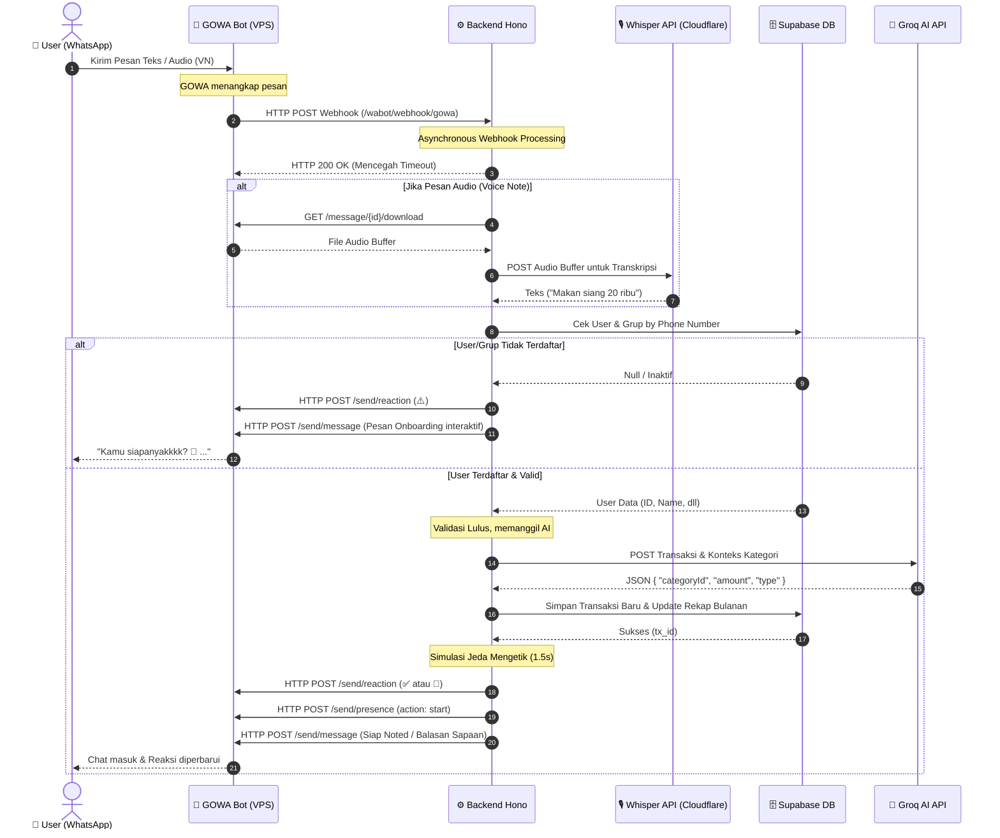
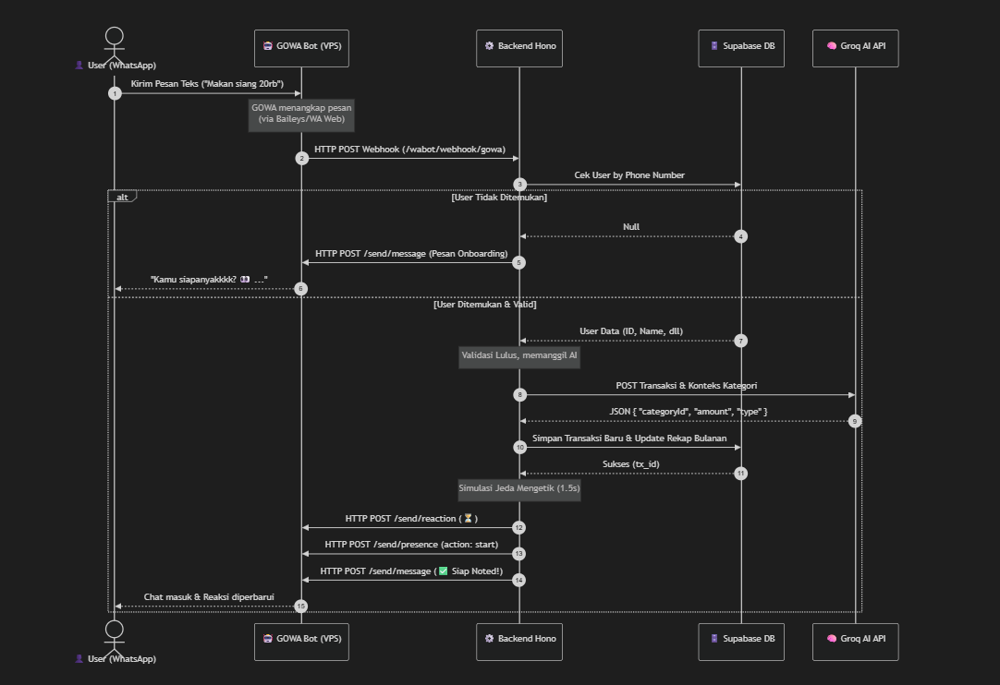

# 🏗️ Arsitektur & Alur Sistem Kainest (GOWA + Backend + Frontend)

Dokumen ini menjelaskan gambaran umum bagaimana seluruh layanan dalam ekosistem **Kainest** saling berkomunikasi, mulai dari sisi pengguna (WhatsApp / Web) hingga eksekusi AI dan Database.

---

## 🌍 Peta Lingkungan (Environment)

Untuk menjaga keamanan data dan stabilitas aplikasi, sistem Kainest dibagi menjadi dua environment utama yang berjalan pada VPS yang sama melalui container Docker yang terisolasi.

### 1. Production (Live)
Lingkungan yang digunakan oleh *user* publik.
*   **Frontend Web:** `https://kainest.kenantomfie.site` (Vercel)
*   **Backend Hono:** `https://kainest-be.kenantomfie.site` (VPS / Nginx)
*   **GOWA Bot:** `https://gowa.kenantomfie.com` (VPS / Nginx, tersambung ke nomor WA Official)
*   **Database:** Supabase PostgreSQL (Production Schema)

### 2. Staging (Testing / Development)
Lingkungan khusus administrator & developer untuk bereksperimen.
*   **Frontend Web:** `https://staging.kainest.kenantomfie.site` (Vercel)
*   **Backend Hono:** `https://staging.kainest-be.kenantomfie.site` (VPS / Nginx)
*   **GOWA Bot Staging:** Berjalan pada port/nomor berbeda dengan *Safe Mode* aktif (Hanya merespons daftar nomor WA Admin).
*   **Database:** Supabase PostgreSQL (Staging Schema / Data Mockup)

---

## 🔄 Alur Transaksi WhatsApp (Bot Flow)

Berikut adalah urutan proses (*Sequence*) apa yang terjadi saat Anda mengirimkan teks ("Makan siang 20rb") atau *Voice Note* (Pesan Suara) ke bot Kainest di WhatsApp.

### Penjelasan Detail Tiap Aktor:

1. **🤖 GOWA Bot (Go-WhatsApp):**
   Tugasnya murni sebagai **Jembatan/Kurir** (*Gateway*). GOWA membaca pesan WA secara *real-time* lalu melempar isinya ke Backend, dan mengeksekusi pengiriman pesan dari Backend.
2. **⚙️ Backend Hono (Node.js):**
   Ini adalah **Otak Utama (Central Hub)**. Memegang *Business Logic* (Autentikasi, Filter Spam, Verifikasi, Limit Kantong). Merespons *webhook* GOWA secara asinkron agar tidak terjadi *timeout*.
3. **🎙️ Cloudflare Whisper API:**
   Berperan sebagai pengonversi suara ke teks. Menangani input berupa *Voice Note* untuk mempermudah pencatatan transaksi tanpa mengetik.
4. **🧠 Groq AI:**
   Berperan sebagai **Analis Data (Classifier)**. Mengubah *Natural Language* menjadi JSON terstruktur (menentukan kategori, tipe INCOME/EXPENSE, dan nominal).
5. **👤 Frontend Web (Vue 3):**
   Berperan sebagai **Dashboard & Control Panel** (Kategori, Tren Keuangan, Pengaturan).

---

## 🔒 Sistem "Safe Mode" pada Staging
Agar bot *Staging* tidak membocorkan pesan ke publik ketika sedang disempurnakan, Kainest Backend memiliki *Gatekeeper* khusus:
1. Ia mendeteksi variabel `BOT_ENV_MODE=staging`.
2. Saat ada Webhook masuk dari GOWA, Backend akan memeriksa `STAGING_ALLOWED_NUMBERS`.
3. Jika pengirim BUKAN admin, Backend merespons Webhook GOWA dengan **HTTP 200 OK (ignored)**, sehingga bot diam seribu bahasa.
4. Pengecualian pada *Voice Note* di mode staging, jika dari admin akan tetap diproses.

