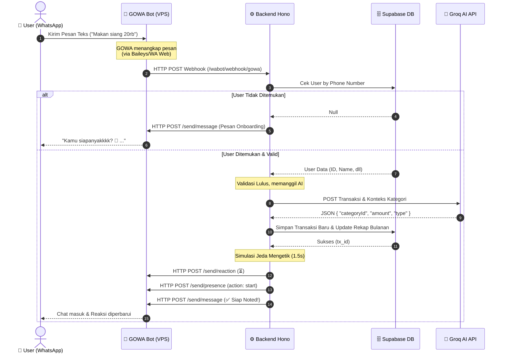

# 🏗️ Arsitektur & Alur Sistem Kainest (GOWA + Backend + Frontend)

Dokumen ini menjelaskan gambaran umum bagaimana seluruh layanan dalam ekosistem **Kainest** saling berkomunikasi, mulai dari sisi pengguna (WhatsApp / Web) hingga eksekusi AI dan Database.

---

## 🌍 Peta Lingkungan (Environment)

Untuk menjaga keamanan data dan stabilitas aplikasi, sistem Kainest dibagi menjadi dua environment utama yang berjalan pada VPS yang sama melalui container Docker yang terisolasi.

### 1. Production (Live)
Lingkungan yang digunakan oleh *user* publik.
*   **Frontend Web:** `https://kainest.kenantomfie.site` (Vercel)
*   **Backend Hono:** `https://kainest-be.kenantomfie.site` (VPS / Nginx)
*   **GOWA Bot:** `https://gowa.kenantomfie.com` (VPS / Nginx, tersambung ke nomor WA Official)
*   **Database:** Supabase PostgreSQL (Production Schema)

### 2. Staging (Testing / Development)
Lingkungan khusus administrator & developer untuk bereksperimen.
*   **Frontend Web:** `https://staging.kainest.kenantomfie.site` (Vercel)
*   **Backend Hono:** `https://staging.kainest-be.kenantomfie.site` (VPS / Nginx)
*   **GOWA Bot Staging:** Berjalan pada port/nomor berbeda dengan *Safe Mode* aktif (Hanya merespons daftar nomor WA Admin).
*   **Database:** Supabase PostgreSQL (Staging Schema / Data Mockup)

---

## 🔄 Alur Transaksi WhatsApp (Bot Flow)

Berikut adalah urutan proses (*Sequence*) apa yang terjadi saat Anda mengetik *"Makan siang 20rb"* ke bot Kainest di WhatsApp.

### Penjelasan Detail Tiap Aktor:

1. **🤖 GOWA Bot (Go-WhatsApp):**
   Tugasnya murni sebagai **Jembatan/Kurir** (*Gateway*). GOWA tidak memiliki kecerdasan buatan ataupun database. Tugas utamanya adalah membaca pesan WA secara *real-time* lalu melempar isinya ke Backend, dan jika disuruh Backend untuk mengirim pesan, GOWA akan mengeksekusinya.
2. **⚙️ Backend Hono (Node.js):**
   Ini adalah **Otak Utama (Central Hub)**. Ia yang memegang *Business Logic* (Autentikasi, Filter Spam Staging, Verifikasi User, Validasi Limit Kantong). Ia yang memutuskan apakah sebuah pesan harus diabaikan, dibalas error, atau diteruskan ke AI.
3. **🧠 Groq AI:**
   Berperan sebagai **Analis Data (Classifier)**. Tugasnya murni hanya untuk merubah *Natural Language* ("*beli rokok indomaret 30k*") menjadi JSON yang terstruktur sehingga Backend tahu ini masuk kategori apa dan saldonya akan dipotong dari dompet mana.
4. **👤 Frontend Web (Vue 3):**
   Berperan sebagai **Dashboard & Control Panel**. Pengguna masuk ke web ini bukan untuk transaksi harian, melainkan untuk mengatur kategori, melihat grafik analitik keuangan, serta mengambil *Link Code* untuk aktivasi bot WhatsApp. Web ini me-*request* data (API Fetch) secara langsung ke **Backend Hono**.

---

## 🔒 Sistem "Safe Mode" pada Staging
Agar bot *Staging* tidak membocorkan pesan ke publik ketika sedang disempurnakan, Kainest Backend memiliki *Gatekeeper* khusus:
1. Ia mendeteksi variabel `BOT_ENV_MODE=staging`.
2. Saat ada Webhook masuk dari GOWA, Backend akan memeriksa `STAGING_ALLOWED_NUMBERS`.
3. Jika pengirim BUKAN admin, Backend merespons Webhook GOWA dengan **HTTP 200 OK (ignored)**, sehingga bot diam seribu bahasa.
4. Ini mencegah bot *Staging* yang tidak stabil dari tidak sengaja membalas pesan pengguna *Production*.
