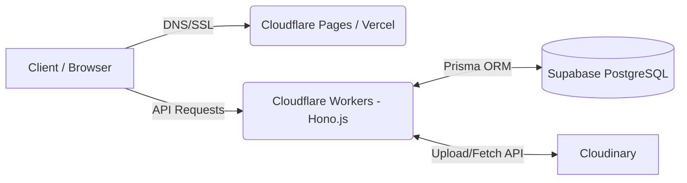

# Arsitektur Infrastruktur & Environment (Paket Ideal - Free Tier)

Berikut adalah breakdown arsitektur infrastruktur untuk aplikasi Kainest, menggunakan kombinasi layanan dengan tier gratis (Free Forever) yang sangat cocok untuk fase awal atau produksi skala kecil.

## Komponen Infrastruktur

| Komponen | Teknologi / Platform | Keterangan |
| :--- | :--- | :--- |
| **Frontend** | Vue 3 + (Vite/Nuxt) | UI framework yang reaktif dan modern. |
| **Frontend Hosting** | Cloudflare Pages / Vercel | Hosting gratis, mendukung CI/CD otomatis dari GitHub. |
| **Backend Framework** | Hono.js | Web framework yang ringan dan sangat cepat, dioptimasi untuk edge runtimes. |
| **Backend Hosting** | Cloudflare Workers | Serverless backend, gratis hingga 100k requests/hari. |
| **Database** | Supabase (PostgreSQL) | Database relasional open-source. Tier gratis menyediakan storage 500MB, ideal untuk data awal. |
| **ORM (Object Relational Mapping)**| Prisma | Menjembatani kode TypeScript dengan database Supabase secara type-safe. |
| **Image / Media Storage** | Cloudinary | CDN dan manajemen media gratis hingga 25 Credits (kurang lebih 2GB storage / bandwidth). |
| **Otentikasi (Auth)** | Custom (JWT) atau Supabase Auth | Bisa menggunakan Supabase Auth (Gratis tier cukup besar) atau JWT mandiri berbasis tabel Users. |
| **DNS & SSL / Custom Domain** | Cloudflare DNS | Proxy, DNS management, dan SSL gratis untuk custom domain. |

## Diagram Sederhana

## Keuntungan Setup Ini
1. **Biaya Rp 0:** Sangat minim risiko finansial untuk validasi ide (MVP).
2. **Skalabilitas Mudah:** Jika trafik naik, semua layanan di atas memiliki tier berbayar yang mudah di-upgrade.
3. **Performa Tinggi:** Cloudflare Workers menjalankan backend di Edge location yang dekat dengan user. Hono.js sangat optimal di environment tersebut.
4. **Developer Experience (DX):** Prisma + TypeScript + Hono memberikan pengalaman coding yang aman dan terstruktur.